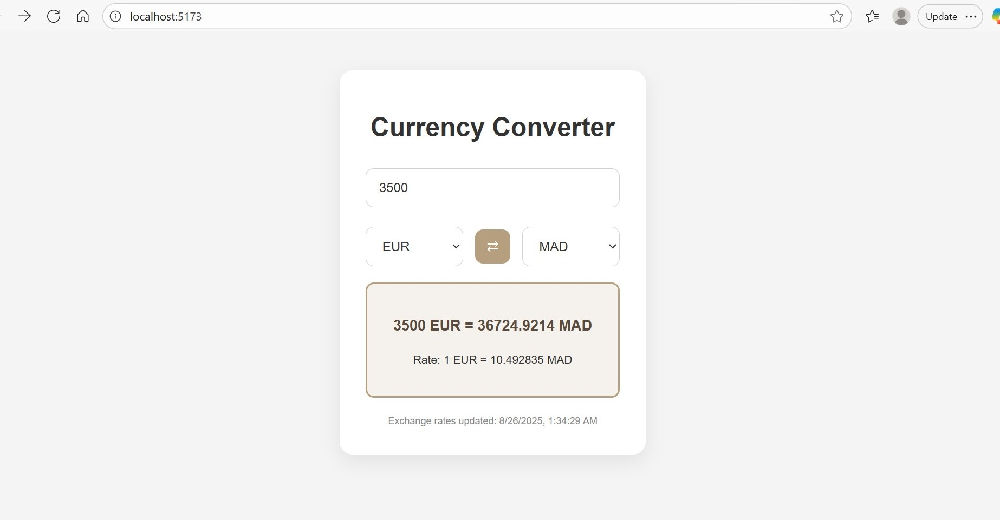

# Currency Converter

A **currency converter** web app built with **React**. Users can convert an amount from one currency to another, view real-time conversion rates, and switch currencies easily.  

## Features

- Convert between multiple currencies using real-time rates from a backend API.
- Switch between the "from" and "to" currencies with a single button.
- Clean, professional, and responsive UI.
- Shows conversion rates and timestamps.
- Handles invalid inputs gracefully.

## Demo

  

## Technologies Used

- **Frontend:** React, CSS
- **Backend (for rates):** Flask +  API providing currency rates
- **Styling:** Custom CSS with neutral color palette

