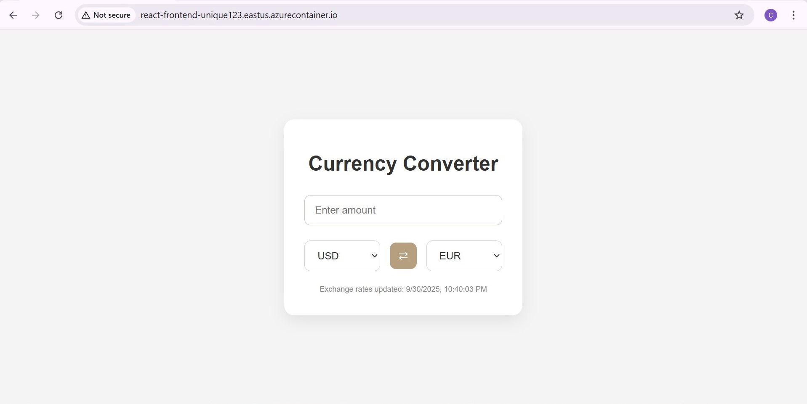
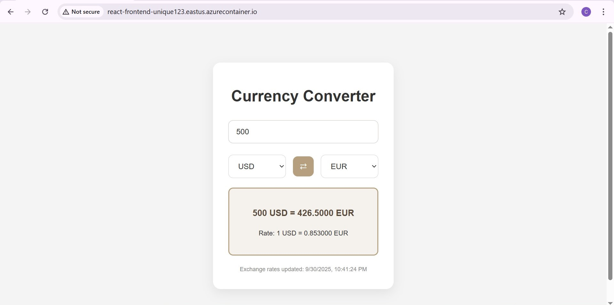

# 💱 Currency Converter Web App

A full-stack **currency converter** built with **React (frontend)** and **Flask (backend)**, fully containerized with **Docker** and deployed on **Azure Cloud**.


 This project highlights my skills in **frontend, backend, cloud deployment, and DevOps pipelines** and my ability to **design, develop, and deploy** a complete web application using modern tools.

---

##  Features

*  Real-time exchange rates
*  Convert instantly between currencies
*  One-click switch between “from” and “to”
*  Displays live conversion rates
*  Dockerized frontend & backend using GitHub Actions
*  Deployed to Azure 

---

##  Tech Stack

* **Frontend:** React (Vite), TailwindCSS, Nginx
* **Backend:** Flask (Python), Gunicorn
* **Deployment:** Docker, GitHub Actions, Azure Container Instances

---

##  Structure

```
currency-converter/
├── backend/   # Flask API
├── frontend/  # React UI
└── .github/   # CI/CD pipeline
```

---

##  Docker

```bash
# Backend
docker build -t currencyconverter-web ./backend
docker run -p 5000:5000 currencyconverter-web

# Frontend
docker build -t currencyconverter-frontend ./frontend
docker run -p 80:80 currencyconverter-frontend
```

---

##  Deployment

* Images built & pushed to DockerHub via **GitHub Actions**
* Deployed to **Azure Container Instances**

---

##  Demo





---

##  About Me

**Chaimae El Bakay**
 Computer Science Engineering Student
 Passionate about Full-Stack Development & AI
 Building projects that connect **software + cloud + AI**

---


